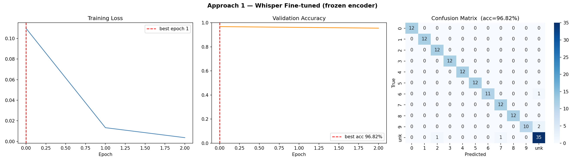
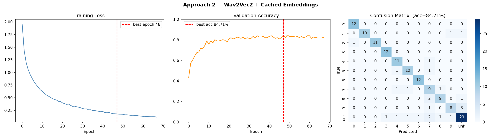
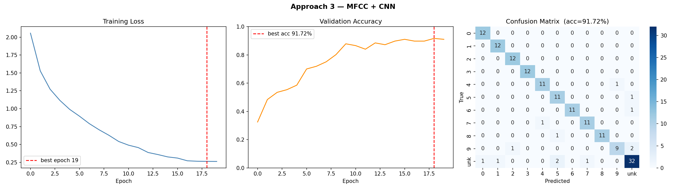
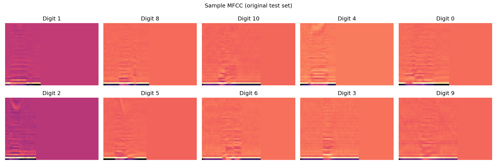

# Hindi Digit Recognition

Spoken Hindi digit recognition (शून्य–नौ, i.e. 0–9) plus an **Unknown** class for out-of-vocabulary speech — implemented with three different deep learning approaches and compared on the same dataset.

> **SMAI Assignment 3**

---

## Table of Contents

1. [Task](#task)
2. [Dataset](#dataset)
3. [Approaches](#approaches)
4. [Project Structure](#project-structure)
5. [Setup](#setup)
6. [Training](#training)
7. [Live Inference](#live-inference)
8. [Results](#results)

---

## Task

Classify a short WAV recording of a spoken Hindi digit into one of **11 classes**:

| Class | Hindi | Romanized |
|-------|-------|-----------|
| 0 | शून्य | shunya |
| 1 | एक | ek |
| 2 | दो | do |
| 3 | तीन | teen |
| 4 | चार | chaar |
| 5 | पाँच | paanch |
| 6 | छह | chhah |
| 7 | सात | saat |
| 8 | आठ | aath |
| 9 | नौ | nau |
| 10 | — | **Unknown** (non-digit / OOV) |

---

## Dataset

**SMAI Dataset (wav)** — WAV recordings organized into per-class folders (0–10). Not included in this repo; place it at the root before running anything.

```
SMAI Dataset (wav)/
├── 0/    ← शून्य recordings
├── 1/    ← एक   recordings
├── ...
└── 10/   ← unknown / non-digit speech
```

### Augmentation

Run `augment_dataset.py` **once before training**. It:

- Creates an 80/20 stratified train/test split on the original files → saves `dataset_split.json`
- Generates 5 augmented variants per training clip using: time stretching (0.85–1.15×), pitch shifting (±3 semitones), additive Gaussian noise, volume perturbation (0.5–1.5×), and speed perturbation
- Saves augmented WAVs to `SMAI Dataset (wav) - Augmented/`

```bash
python augment_dataset.py
```

> The test set uses **original files only** to ensure fair evaluation.

---

## Approaches

### Approach 1 — Fine-tuned Whisper (tiny)

`openai/whisper-tiny` with the **encoder frozen** and the decoder fine-tuned to transcribe Hindi digit words. At inference, the transcription is matched against a keyword dictionary (Hindi + English + romanized forms). Any transcription that doesn't match a known digit → class 10 (Unknown).

| | |
|---|---|
| Base model | `openai/whisper-tiny` |
| Frozen | Encoder |
| Optimizer | AdamW, lr=5e-5, cosine schedule |
| Batch size | 8 |
| Early stopping | patience=2 |

### Approach 2 — Wav2Vec2 + MLP Classifier

Frozen `facebook/wav2vec2-base` encoder produces 768-dim mean-pooled embeddings. A small 2-layer MLP head is trained on top. Embeddings are extracted **once and cached** — only the head trains, making epochs very fast.

```
Audio → [Wav2Vec2 encoder, frozen] → mean-pool → 768-dim
      → Linear(768→256) → ReLU → Dropout(0.4) → Linear(256→11)
```

| | |
|---|---|
| Base model | `facebook/wav2vec2-base` |
| Frozen | Entire encoder |
| Optimizer | Adam, lr=1e-3, cosine schedule |
| Batch size | 64 |
| Early stopping | patience=20 |

### Approach 3 — MFCC + 2D CNN

MFCC + Δ + ΔΔ features stacked into a 3×40×100 tensor, fed to a lightweight 2D ConvNet trained **from scratch** — no pretrained model required.

```
Audio → MFCC (40 coeff) + Δ + ΔΔ → (3, 40, 100) tensor
      → 3× [Conv2d → BN → ReLU → MaxPool → Dropout]
      → AdaptiveAvgPool → Linear(2048→256) → Linear(256→11)
```

| | |
|---|---|
| Optimizer | Adam, lr=1e-3, weight decay=1e-4, cosine schedule |
| Batch size | 16 |
| Early stopping | patience=3 |

---

## Project Structure

```
Hindi-Digit-Recognition/
├── augment_dataset.py       # Data augmentation + train/test split
├── dataset_split.json       # Auto-generated by augment_dataset.py
├── all_approaches.ipynb     # Full training pipeline for all 3 approaches
├── requirements.txt
│
├── inference/
│   ├── live_inference1_whisper.py    # Terminal mic demo — Approach 1
│   ├── live_inference2_wav2vec2.py   # Terminal mic demo — Approach 2
│   └── live_inference3_mfcc_cnn.py   # Terminal mic demo — Approach 3
│
└── results/
    ├── approach1_results.png         # Loss + accuracy + confusion matrix
    ├── approach2_results.png
    ├── approach3_results.png
    └── approach3_mfcc.png            # Sample MFCC visualizations
```

---

## Setup

```bash
git clone https://github.com/AG2M4N/Hindi-Digit-Recognition.git
cd Hindi-Digit-Recognition
pip install -r requirements.txt
```

Place `SMAI Dataset (wav)/` in the repo root, then run:

```bash
python augment_dataset.py
```

---

## Training

All three training pipelines are in the unified notebook:

```bash
jupyter notebook all_approaches.ipynb
```

Run cells top to bottom. Each approach:
1. Loads the augmented training data
2. Trains with early stopping (best val accuracy checkpoint saved)
3. Evaluates on the original test set
4. Outputs a results plot (loss curve, accuracy curve, confusion matrix)

Trained model weights are saved locally but not tracked in this repo (see `.gitignore`).

---

## Live Inference

Hold **Enter** to record, release to get a prediction. Press **Esc** to quit.

```bash
# Requires trained model weights saved from the notebook
python inference/live_inference1_whisper.py
python inference/live_inference2_wav2vec2.py
python inference/live_inference3_mfcc_cnn.py
```

Approaches 2 and 3 display a top-3 confidence breakdown. Approach 1 shows the raw Whisper transcription and the matched keyword.

**macOS:** System Settings → Privacy & Security → Microphone → enable for Terminal.

---

## Results

| | Approach 1 — Whisper | Approach 2 — Wav2Vec2 | Approach 3 — MFCC CNN |
|---|---|---|---|
| Strategy | Seq2seq + keyword match | Frozen embeddings + MLP | Hand-crafted features + CNN |
| Confidence scores | No (keyword match) | Yes (softmax) | Yes (softmax) |

### Approach 1 — Whisper


### Approach 2 — Wav2Vec2


### Approach 3 — MFCC + CNN


Sample MFCC features (one per digit class):


